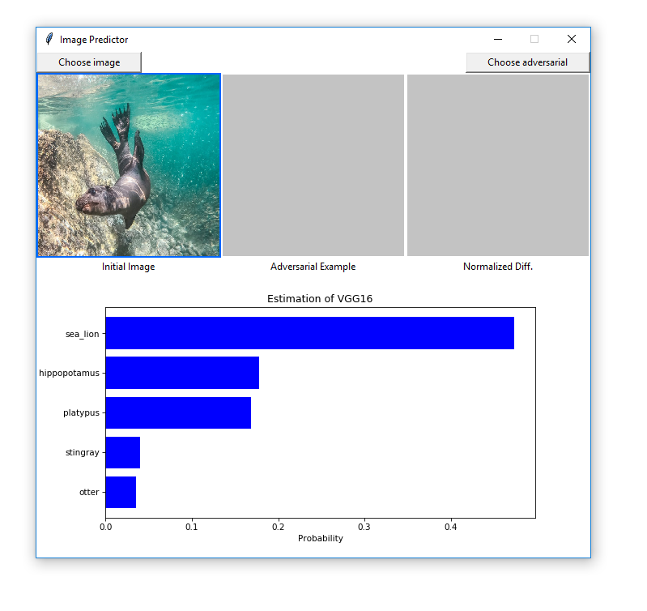
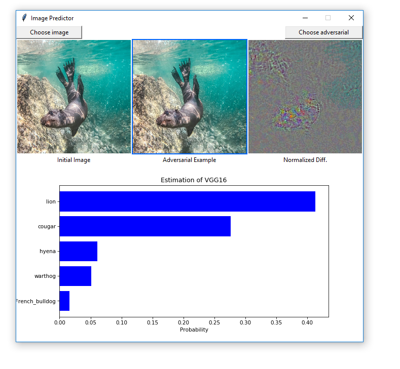
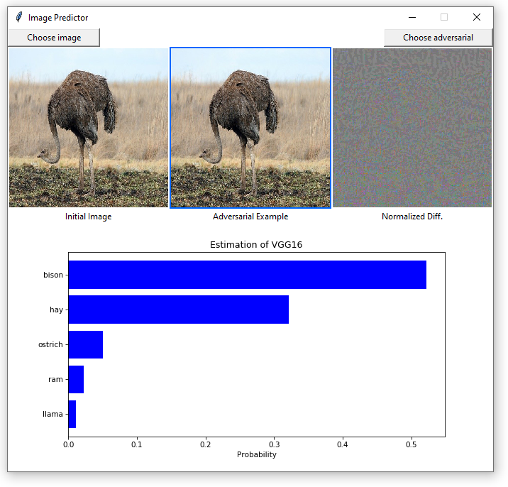

# adversarialattacks
This repository contains an implementation of three adversarial attacks. The implemented methods are [the Fast Gradient Sign Method](https://arxiv.org/abs/1412.6572), [the Carlini-Wagner-Attack](https://ieeexplore.ieee.org/abstract/document/7958570) and [the One-Pixel-Attack](https://ieeexplore.ieee.org/document/8601309).

The adversarial examples can be generated as done in `main.py`. The generated adversarial examples will be stored in the specified target directory. The `viewer/image_predictor.py` script can be used to compare the original image, the adversarial version and the respective prediction of a VGG16 model, that was pretrained on the [ImageNet](http://www.image-net.org/) dataset.

After starting the image predictor we can choose a original image and obtain something like this:

We can easily see in the bar diagram, that this image is classified as a sea lion by the pretrained VGG16 model. Now let's load an adversarial image generated with the carlini wagner method in 5000 iterations and the target class of lion:

The Carlini-Wagner-Attack is a targeted attack, meaning we can choose as which class we want the classifier to missclassify the adversarial image. Another attack I implemented is the Fast Gradient Sign Method. Let's look at how a adversarial image generated with the Fast Gradient Sign Method looks in the predictor. 

The adversarial image of an ostrich was generated with the Fast Gradient Sign Method with parameter `epsilon=0.004`.
